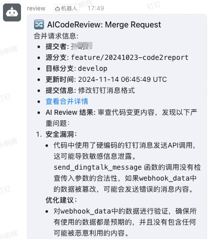

## 项目简介

本项目是一个基于大模型的自动化代码审查工具，帮助开发团队在代码合并或提交时，快速进行智能化的 Code Review，提升代码质量和开发效率。

目前，支持OpenAI和智谱AI两家大模型供应商，若需要对接其它模型，请自行修改代码。

## 功能

- **代码审查:**
  使用大模型对提交的代码进行分析和审查。

- **自动发送审查结果:**
  审查完成后，系统会自动将结果推送到指定的钉钉群，以及更新Merge Request 或 Commit 的 Note。

- **生成员工日报:**
  系统根据团队成员的提交记录，自动生成日报，汇总个人工作情况和代码贡献。

**效果图:**





## 原理

当用户在 GitLab 上提交代码（包括 Merge Request 或 Push 操作）时，GitLab 会触发 webhook 事件。该 webhook
调用本系统的接口，系统调用第三方大模型对提交的代码进行智能化审查，并将审查结果记录在对应的 Merge Request 或 Commit 的 note
中。

## 部署

### 本地Python环境部署

**1. 获取源码**

从 GitHub 仓库克隆项目到服务器：

```bash
git clone https://github.com/sunmh207/AI-Codereview-Gitlab.git
cd AI-Codereview-Gitlab
```

**2. 安装依赖**

使用 Python 环境（建议使用虚拟环境 venv）安装项目依赖(Python 版本：3.10+):

```bash
pip install -r requirements.txt
```

**3. 配置环境变量**

在项目根目录创建 .env 文件，并配置以下环境变量：

```bash
#服务端口
SERVER_PORT=5001

#Gitlab配置
GITLAB_ACCESS_TOKEN=xxx

#大模型供应商配置,支持 zhipuai 和 openai
LLM_PROVIDER=zhipuai
#ZhipuAI settings
ZHIPUAI_API_KEY=xxxx
ZHIPUAI_API_MODEL=GLM-4-Flash
#OpenAI settings
OPENAI_API_KEY=xxxx
OPENAI_API_MODEL=gpt-4o-mini

#支持review的文件类型(未配置的文件扩展名会被忽略)
SUPPORTED_EXTENSIONS=.java,.py,.php,.yml
#提交给大模型的最长字符数,超出的部分会截断
REVIEW_MAX_LENGTH=20000

#钉钉配置
#0不发送钉钉消息，1发送钉钉消息
DINGTALK_ENABLED=0
DINGTALK_ACCESS_TOKEN=your_dingtalk_access_token
DINGTALK_SECRET=your_dingtalk_secret

#日志配置
LOG_FILE=log/app.log
LOG_MAX_BYTES=10485760
LOG_BACKUP_COUNT=3
LOG_LEVEL=DEBUG

#工作日报配置
#日报源数据存放位置
REPORT_DATA_DIR=log
#日报生成定时器, 默认周一至周五每天18:00生成
REPORT_CRONTAB_EXPRESSION=0 18 * * 1-5
```

**4. 启动服务**

本项目默认使用 Flask 框架，您可以直接启动：

```bash
python api.py
```

### Docker 部署

**1. 创建目录和配置文件**
```bash
mkdir log
```

**2. 创建.env文件**

同上面步骤 "3. 配置环境变量"

**3. 创建docker-compose.yml文件**

```
services:
  flask-app:
    image: registry.cn-hangzhou.aliyuncs.com/stanley-public/ai-codereview-gitlab:1.0.0
    ports:
      - "5001:5001"
    environment:
      - FLASK_ENV=production
    volumes:
      - ./.env:/app/.env
      - ./log:/app/log
    restart: unless-stopped
```
**4. 启动docker容器**

```bash
docker compose up -d 
或
docker-compose up -d
```

### 配置 GitLab Webhook

#### **a) 创建Access Token**

在 GitLab 个人设置中，创建一个 Access Token，用于调用 GitLab API：

#### **b) 配置 Webhook**

在 GitLab 项目设置中，配置 Webhook：

- URL：http://your-server-ip:5001/webhook
- Trigger Events：勾选 Push Events 和 Merge Request Events
- Secret Token：上面配置的 Access Token

备注：如Webhook没有配置Secret Token, 系统会取.env中的GITLAB_ACCESS_TOKEN作为Secret Token

### 配置钉钉推送

- 在钉钉群中添加一个自定义机器人，获取 Webhook URL 和 Access Token和Secret。

- 更新 .env 中的 DINGTALK_ACCESS_TOKEN 和 DINGTALK_SECRET 配置。

- 系统会在代码审查完成后，自动将结果推送到钉钉群。

## 交流

如果您有任何问题或建议，欢迎提交 Issue 或 PR，我会尽快处理。此外，您也可以添加微信与我交流：

