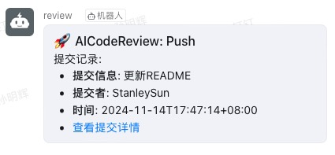
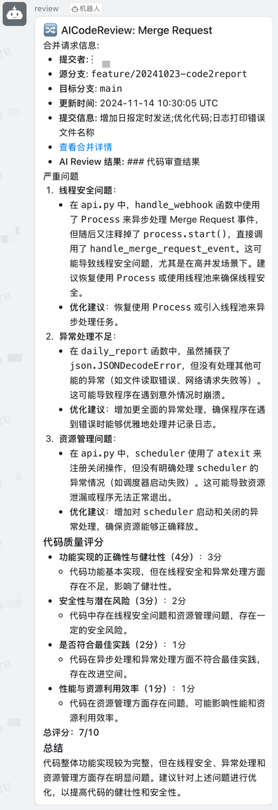
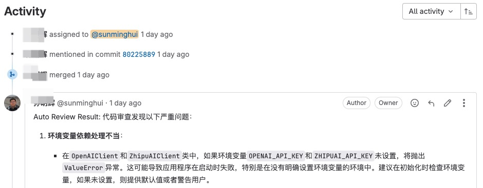
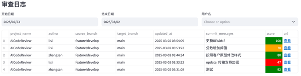
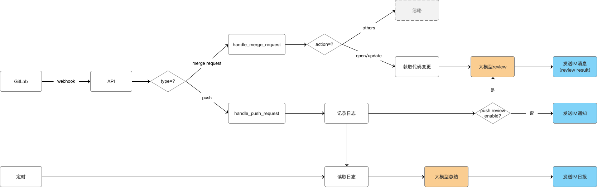

## 项目简介

本项目是一个基于大模型的自动化代码审查工具，帮助开发团队在代码合并或提交时，快速进行智能化的审查(Code Review)，提升代码质量和开发效率。

## 功能

- 多大模型支持：兼容 DeepSeek、ZhipuAI、OpenAI 和 Ollama。
- 消息推送：审查结果可自动推送至钉钉、企业微信和飞书;
- 自动化日报生成：基于 GitLab Commit 记录，自动整理开发日报；
- 可视化 Dashboard：集中展示 Code Review 记录。

**效果图:**









## 原理

当用户在 GitLab 上提交代码（如 Merge Request 或 Push 操作）时，GitLab 将自动触发 webhook 事件，调用本系统的接口。系统随后通过第三方大模型对代码进行审查，并将审查结果直接反馈到对应的 Merge Request 或 Commit 的 Note 中，便于团队查看和处理。



## 部署

### 方案一：Docker 部署

**1. 创建.env文件**

复制本项目 .env.dist 文件内容到本地 .env 文件，并根据实际情况修改, 部分内容如下：

```bash
#服务端口
SERVER_PORT=5001

#大模型供应商配置,支持 zhipuai , openai , deepseek or ollama
LLM_PROVIDER=deepseek

#DeepSeek
DEEPSEEK_API_KEY={YOUR_DEEPSEEK_API_KEY}

#支持review的文件类型(未配置的文件类型不会被审查)
SUPPORTED_EXTENSIONS=.java,.py,.php,.yml
#提交给大模型的最长字符数,超出的部分会截断,防止大模型处理内容过长或Token消耗过多
REVIEW_MAX_LENGTH=20000

#钉钉消息推送: 0不发送钉钉消息,1发送钉钉消息
DINGTALK_ENABLED=0
DINGTALK_WEBHOOK_URL={YOUR_WDINGTALK_WEBHOOK_URL}

#Gitlab配置
GITLAB_ACCESS_TOKEN={YOUR_GITLAB_ACCESS_TOKEN}
```

**2. 启动docker容器**

```bash
docker run --rm --name ai-codereview-gitlab \
  -p 5001:5001 \
  -p 5002:5002 \
  -v $(pwd)/.env:/app/.env \
  -e TZ=Asia/Shanghai \
  sunmh207/ai-codereview-gitlab:1.2.2
```

**3. 验证服务**

访问 http://your-server-ip:5001 显示 "The code review server is running." 说明服务启动成功。

访问 http://your-server-ip:5002 看到一个审查日志页面，说明 Dashboard 启动成功。

### 方案二：本地Python环境部署

**1. 获取源码**

```bash
git clone https://github.com/sunmh207/AI-Codereview-Gitlab.git
cd AI-Codereview-Gitlab
```

**2. 安装依赖**

使用 Python 环境（建议使用虚拟环境 venv）安装项目依赖(Python 版本：3.10+):

```bash
pip install -r requirements.txt
```

**3. 配置环境变量**

同 Docker 部署方案中的 【创建.env文件】

**4. 启动服务**

- 启动API服务：

```bash
python api.py
```

- 启动Dashboard服务：

```bash
streamlit run ui.py --server.port=5002 --server.address=0.0.0.0
```

### 配置 GitLab Webhook

#### 1. 创建Access Token**

方法一：在 GitLab 个人设置中，创建一个 Personal Access Token。

方法二：在 GitLab 项目设置中，创建Project Access Token

#### 2. 配置 Webhook**

在 GitLab 项目设置中，配置 Webhook：

- URL：http://your-server-ip:5001/review/webhook
- Trigger Events：勾选 Push Events 和 Merge Request Events (不要勾选其它Event)
- Secret Token：上面配置的 Access Token(可选)

备注：系统会优先使用.env中的GITLAB_ACCESS_TOKEN，如果未找到，则使用Webhook 传递的Secret Token

### 配置消息推送

#### 1.配置钉钉推送

- 在钉钉群中添加一个自定义机器人，获取 Webhook URL。
- 更新 .env 中的配置：
  ```
  #钉钉配置
  DINGTALK_ENABLED=1  #0不发送钉钉消息，1发送钉钉消息
  DINGTALK_WEBHOOK_URL=https://oapi.dingtalk.com/robot/send?access_token=xxx #替换为你的Webhook URL
  ```

#### 2.配置企业微信推送

- 在企业微信群中添加一个自定义机器人，获取 Webhook URL。

- 更新 .env 中的配置：
  ```
  #企业微信配置
  WECOM_ENABLED=1  #0不发送企业微信消息，1发送企业微信消息
  WECOM_WEBHOOK_URL=https://qyapi.weixin.qq.com/cgi-bin/webhook/send?key=xxx  #替换为你的Webhook URL
  ```

#### 3.配置飞书推送

- 在飞书群中添加一个自定义机器人，获取 Webhook URL。
- 更新 .env 中的配置：
  ```
  #飞书配置
  FEISHU_ENABLED=1
  FEISHU_WEBHOOK_URL=https://open.feishu.cn/open-apis/bot/v2/hook/xxx #替换为你的Webhook URL
  ```

## 常见问题

参见 [常见问题](doc/faq.md)

## 交流

若本项目对您有帮助，欢迎 Star ⭐️ 或 Fork。 有任何问题或建议，欢迎提交 Issue 或 PR。

也欢迎加微信/微信群，一起交流学习。

<p float="left">
  
   
</p>

